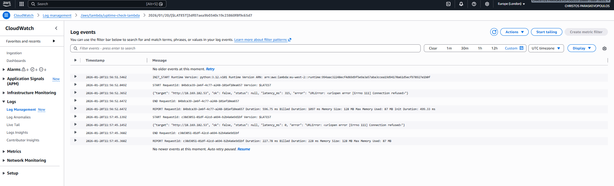

# AWS Uptime Monitor – DevOps Cloud Project

I built this to learn how AWS services actually work together — not by following a tutorial, but by designing something real, deploying it, and then deliberately breaking it to see what happened.

The idea is straightforward: an EC2 server runs a simple HTTP endpoint, and a Lambda function checks it on a schedule. If it goes down, I get an email. If it recovers, monitoring picks back up automatically.

---

## What the system does

A Linux server on AWS EC2 exposes a basic HTTP endpoint via Apache. A serverless Lambda function runs on a schedule and sends an HTTP request to that endpoint.

If the check succeeds, it logs the result and moves on.  
If it fails, it fires an alert through SNS to my email.

Every execution gets logged to CloudWatch — which turned out to be one of the more useful parts of the whole setup once I started actually reading the logs.

---

## Architecture overview

```
EventBridge (schedule)
       |
       v
  Lambda function  ──── HTTP check ────>  EC2 / Apache
       |
    on failure
       |
       v
   SNS Topic  ──>  Email Alert
       |
       v
  CloudWatch Logs
```

The EC2 instance has a static Elastic IP so the monitored endpoint doesn't change. Lambda does the actual checking — it spins up, runs the request, and exits. EventBridge is just the clock that kicks it off. When something fails, Lambda publishes to an SNS topic which handles the email delivery.

IAM roles wire it all together with the minimum permissions needed for each piece to talk to the next.

---

## How I tested it

I didn't consider the project done until I'd seen it fail and recover.

I SSHed into the EC2 instance and stopped Apache manually. On the next scheduled Lambda run, it detected the failure and an alert email landed in my inbox. I restarted Apache, and the following check came back healthy with no further alerts.

It sounds simple, but actually watching that sequence happen — the failure, the alert, the recovery — made the architecture feel real in a way that just deploying it didn't.

---

## What I learned

Going in, I had a rough sense of what EC2 and Lambda were. Coming out, I actually understand how they're different and why that matters.

EC2 is a server you keep running and manage. Lambda is something that runs for a moment and disappears. EventBridge is just a scheduler. SNS handles delivery so Lambda doesn't have to care where the alert goes. CloudWatch is where you look when something isn't behaving.

The bigger architectural lesson was that monitoring needs to live outside the thing it's watching. If my Lambda function was running on the same EC2 instance it was checking, a crash would take both down at once. Keeping them separate is the point.

IAM permissions were also more involved than I expected. Getting the Lambda role scoped correctly — enough access to publish to SNS and write to CloudWatch, nothing more — took a few iterations.

---

## Current state

The infrastructure is fully defined in Terraform under `infra/terraform/`. The entire stack — EC2, Lambda, EventBridge, SNS, IAM, CloudWatch — can be provisioned from scratch with `terraform apply` and torn down cleanly with `terraform destroy`.

The project started as a manual AWS Console build. Converting it to IaC was the second phase, and the difference in confidence between "I clicked through the console once" and "I can recreate this exactly, any time" is significant.

---

## Evidence

Screenshots from the running system are in the `/docs` folder:

- EC2 instance with Elastic IP
- CloudWatch logs from successful checks
- CloudWatch logs showing the failure when Apache was stopped
- The SNS alert email



---

## Next steps

- Failure thresholds — right now it alerts on the first failed check, which isn't great for transient issues. Adding a consecutive-failure threshold would reduce noise.
- Multi-target monitoring — the architecture supports it, just needs parameterising.
- GitHub Actions — a basic CI workflow to run `terraform fmt` and `terraform validate` on PRs.

---

## Why this project exists

I wanted to stop running things locally and actually understand what cloud infrastructure feels like when you have to think about networking, permissions, observability, and failure modes.

This project did that.
